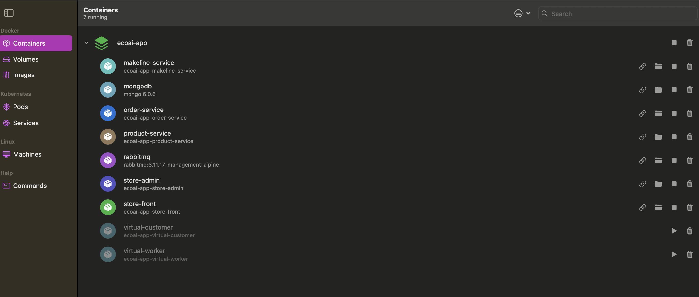
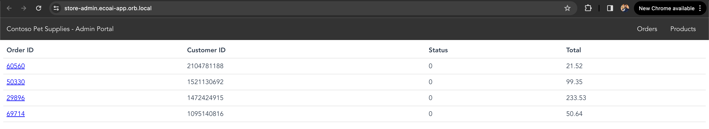
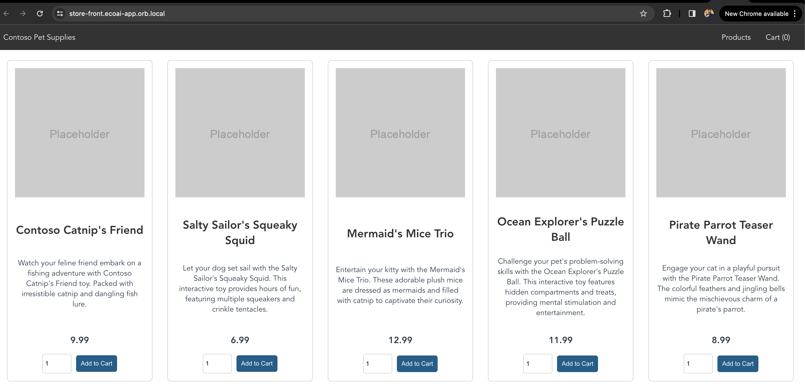
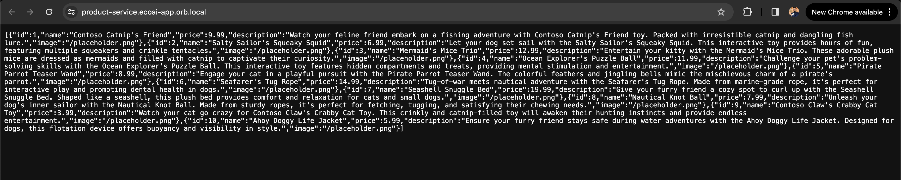

# ecoai-app

Sample e-commerce microservices app that is used for live project demos and experiments. The app demonstrates a realistic scenario using a polyglot architecture, event-driven design, and common open source back-end services such as RabbitMQ and MongoDB. Additionally, the application uses OpenAI's GPT-3 models to generate product descriptions.
This can be done using either [Azure OpenAI](https://learn.microsoft.com/azure/ai-services/openai/overview) or [OpenAI](https://openai.com/).

This application is inspired by another demo app called [Red Dog](https://github.com/Azure/reddog-code).

> [!NOTE]
> This is not meant to be an example of perfect code to be used in production, but more about showing a realistic application running in AKS. 

## Architecture

The application has the following services: 

| Service | Description |
| --- | --- |
| `makeline-service` | This service handles processing orders from the queue and completing them (Golang) |
| `order-service` | This service is used for placing orders (Javascript) |
| `product-service` | This service is used to perform CRUD operations on products (Rust) |
| `store-front` | Web app for customers to place orders (Vue.js) |
| `store-admin` | Web app used by store employees to view orders in queue and manage products (Vue.js) | 
| `virtual-customer` | Simulates order creation on a scheduled basis (Rust) |
| `virtual-worker` | Simulates order completion on a scheduled basis (Rust) |
| `ai-service` | Optional service for adding generative text and graphics creation (Python) |
| `mongodb` | MongoDB instance for persisted data |
| `rabbitmq` | RabbitMQ for an order queue |


## Run the app locally using Docker

The application is designed to be run in Kubernetes, but can also be run locally using Docker Compose.

> [!TIP]
> You must have Docker Desktop tool, such as Orbstack or Docker Desktop, installed to run this app locally. 

To run this app locally:

1. Configure your Azure OpenAI or OpenAI API keys in [`docker-compose.yml`](./docker-compose.yml) using the environment variables in the `ai-service` section:

```yaml
  ai-service:
    build: src/ai-service
    container_name: 'ai-service'
    ...
    environment:
      - USE_AZURE_OPENAI=True # set to False if you are not using Azure OpenAI
      - AZURE_OPENAI_DEPLOYMENT_NAME= # required if using Azure OpenAI
      - AZURE_OPENAI_ENDPOINT= # required if using Azure OpenAI
      - OPENAI_API_KEY= # always required
      - OPENAI_ORG_ID= # required if using OpenAI
    ...
```

Alternatively, if you do not have access to Azure OpenAI or OpenAI API keys, you can run the app without the `ai-service` by commenting out the `ai-service` section in [`docker-compose.yml`](./docker-compose.yml). For example:

```yaml
#  ai-service:
#    build: src/ai-service
#    container_name: 'ai-service'
...
#    networks:
#      - backend_services
```

Start the app using `docker compose`. For example:

```bash
docker compose up
```

If everything goes well, you can access the result containers in your desktop tool.
The following screenshots are taken from my local Orbstack:

- 
- 
- 
- 

To stop the app, you can hit the `CTRL+C` key combination in the terminal window where the app is running.
